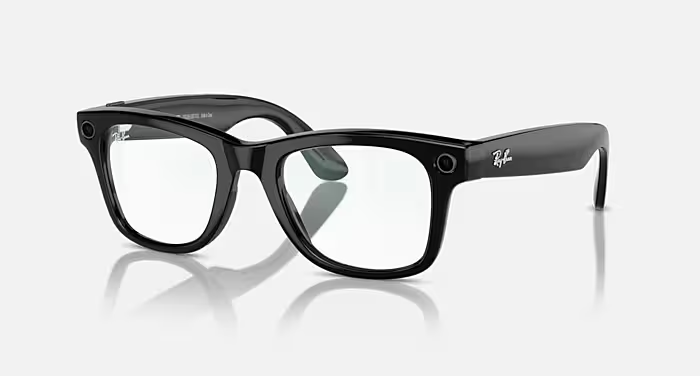
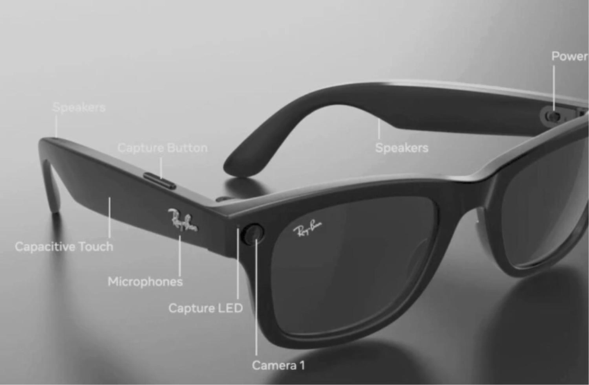

# Rayban x Meta Wayfarer

## Quick Overview 

The Ray-Ban Meta Glasses combine iconic style with advanced smart technology, allowing you to capture moments, listen to audio, make calls, and interact with Meta AI hands-free. Designed for seamless integration into your daily life, these glasses offer a new perspective on wearable tech.

- Capture photos and videos with an upgraded ultra-wide 12 MP camera and five-mic system.
- Listen to music and make hands-free calls with discreet open-ear speakers.
- Access Meta AI for real-time suggestions, answers, and reminders.
- Utilize live translation between French, Italian, Spanish, and English without Wi-Fi.
- Livestream directly to Facebook and Instagram.

## 
Full Video review: https://www.youtube.com/watch?v=oBZ8toFKZls
## 

## Set Up Guide 

### 1. Charge Your Glasses
Place your Ray-Ban Meta Glasses into the included charging case. Connect the USB-C cable to the port on the bottom of the case and plug it into a power source.  
The indicator light on the case will show the charging status.

### 2. Download the Meta View App
Scan the QR code provided in the packaging **or** search for **"Meta View"** in your device’s app store (iOS or Android).  
This app is essential for managing your glasses, importing media, and accessing features.

### 3. Pair Your Glasses
Open the Meta View app and follow the on-screen instructions to pair your glasses with your smartphone via Bluetooth.  
Make sure Bluetooth is enabled on your phone.

### 4. Complete Setup
The app will guide you through the initial configuration, including:
- Connecting to Wi-Fi  
- Activating Meta AI  
- Adjusting privacy preferences  

Once completed, your glasses are ready to use.

## Rayban Meta Smart Glasses Usage Guide

Ray-Ban Meta smart glasses let you capture moments, control music, call people, and access Meta AI hands-free. You mainly use voice commands that start with **"Hey Meta"**, along with a touchpad on the right side of the glasses.

### Voice Commands
---

Say **"Hey Meta"** and then use one of the commands below.

### Camera
- "Hey Meta, take a photo."
- "Hey Meta, start recording."
- "Hey Meta, stop recording."
- "Hey Meta, what's my battery level?"

### Music & Audio
- "Hey Meta, play music."
- "Hey Meta, pause the music."
- "Hey Meta, next song."
- "Hey Meta, volume up."
- "Hey Meta, volume down."

### Calls & Messaging
- "Hey Meta, call *[contact]*."
- "Hey Meta, send a message to *[contact]*."
- "Hey Meta, read my last message."

### Meta AI
- "Hey Meta, what's the weather?"
- "Hey Meta, translate this."
- "Hey Meta, search for *[topic]*."
- "Hey Meta, take a look at this." (visual search using the camera)

### Touch Controls
---
You can control the glasses using the touchpad on the right arm.

- **Tap once** – Play/Pause
- **Swipe forward/back** – Next/Previous song
- **Swipe up/down** – Volume control
- **Press and hold** – Activate Meta AI
- **Double tap** – Answer or end calls

---
### Charging

1. Place the glasses in the charging case.
2. The LED indicator will show the charging status.

## Ray-ban | Meta Wayfarer Components and Usage

- **Camera** : Captures photos and videos from your point of view.

- **Capture Button** : Lets you instantly take a photo or start/stop recording without using voice commands.

- **LED Indicator Light** : Shows when the camera is active to notify people around you.

- **Microphones** : Picks up your voice for commands, calls, and video audio with noise reduction.

- **Speakers** : Plays music, calls, and AI responses while keeping your ears open to the environment.

- **Capacitive Touch (Touchpad)** : Supports tap, swipe, and press gestures to control music, calls, and Meta AI manually.

- **Processor** : Handles image processing, audio processing, connectivity, and AI features.

- **Wireless Modules (Bluetooth / Wi-Fi)** : Connect the glasses to your phone, Meta View app, and enable streaming.

- **Battery** : Powers all internal components and determines the glasses’ usage time.

- **Charging Contacts (Pogo Pins)** : Connect to the charging case to recharge the glasses.

- **Frame & Optics** : Holds all components while functioning as normal sunglasses or prescription glasses.

## Hardware Features and Specifications

The Meta Ray-Ban Display features a monocular display with 600×600 pixel resolution integrated into the right lens, offering a 20-degree field of view with 42 pixels per degree. The display brightness ranges from 30 to 5,000 nits and operates at up to 90 Hz refresh rate. The glasses weigh 69 grams (standard size) or 70 grams (large size) and include Transitions lenses as standard.

Technical specifications include:

- 12 MP camera with 3× digital zoom  
- Six-microphone array system  
- Open-ear speakers with Bluetooth 5.3  
- Qualcomm Snapdragon AR1 Gen1 processor  
- 32 GB internal storage  
- 2 GB LPDDR4x RAM  
- Wi-Fi 6 connectivity  
- IPX4 water resistance rating  

## References 

- https://en.wikipedia.org/wiki/Ray-Ban_Meta 
- https://www.youtube.com/watch?v=oBZ8toFKZls
- https://www.youtube.com/watch?v=SbTc-a29dUQ
- https://www.meta.com/help/ai-glasses/289032793766239/?srsltid=AfmBOoppai-YEENyNPO1Dzb3k5qCbrZc0CN7gg9tlZqP6pj2QDL3IQN9
- https://manuals.plus/asin/B0D4GN3QLG
- https://www.ray-ban.com/usa/c/frequently-asked-questions-ray-ban-meta-smart-glasses 

